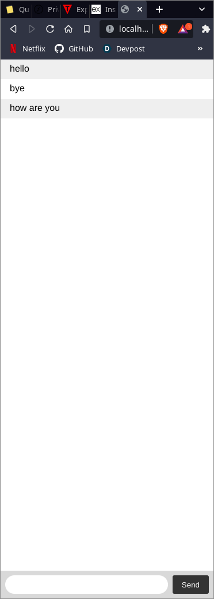

# Chat Web App
### Express.js, Socket.io
---

## Development
1. Clone the git repository
2. Start the node server

    ```node index.js```
3. Open ```localhost:3000``` in multiple tabs on web browswer and start chatting
